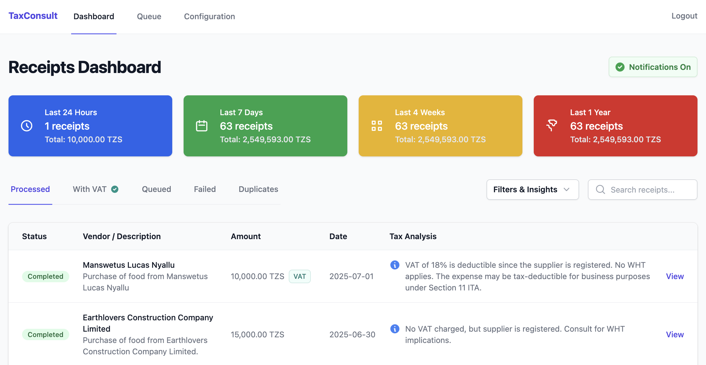

# Karani ✨🇹🇿

[](https://www.gnu.org/licenses/agpl-3.0)
[](LICENSE-COMMERCIAL.md)

An open-source, self-hostable AI agent designed to help Tanzanian businesses automate and simplify expense reporting by intelligently processing EFD (Electronic Fiscal Device) receipts.



## The Problem

For many businesses in Tanzania, managing and recording expenses is a tedious, manual process. Collecting physical EFD receipts, manually entering data into spreadsheets, and ensuring compliance for audits is time-consuming and prone to errors. This administrative burden takes valuable time away from focusing on growing the business.

## The Solution


**Karani** transforms this process. By deploying your own private instance of this agent, you create a central hub that can:
1.  **Receive** receipts from various sources (WhatsApp, Telegram, Web App, etc.) via a secure API.
2.  **Verify and Parse** a receipt URL from a QR code against the TRA portal, reading every field straight off the verified page. Photographed receipts, which have no machine-readable source, are read by a vision model instead.
3.  **Extract Key Data** such as Vendor Name, TIN, VRN, EFD serial, Date, line items, per-rate tax and totals.
4.  **Automate Logging** by exporting this structured data directly to your preferred destination, like a Google Sheet, an S3 bucket, or a custom webhook.

This project empowers you to build your own internal, automated accounting assistant.

## Key Features

-   **Multi-Channel Input**: Submit receipts via URL or direct image upload through a secure API endpoint.
-   **A Scanner That Works With No Signal**: An installable phone app (`/scan/`) that opens straight into a fullscreen QR scanner — no menu, no login screen, camera live in about a second. It is offline-first in the literal sense: with the network switched off it still opens, still scans, still shows history, and queues everything in IndexedDB until connectivity returns. Nothing is loaded from a CDN at runtime.
-   **Exact Extraction from TRA**: The verified receipt page is structured HTML, so it is parsed, not guessed at — vendor, TIN, VRN, EFD serial, Z number, tax office, line items, each printed tax rate and the totals, exactly as TRA issued them. Amounts are stored as integer cents, never floats.
-   **AI for Judgment, Not Facts**: The LLM (Groq, OpenAI) is given the parsed JSON and asked only what the purchase *means* — expense category, deductibility, input VAT and withholding tax. It cannot invent a date or an amount, it costs a fraction of the tokens the scraped page did, and when it is unreachable the receipt is still recorded in full.
-   **Compliance Checks, Computed Not Guessed**: Every receipt is scored 0–100 against checks that decide real money — is the invoice made out to *your* TIN (input VAT is not claimable otherwise), does the printed tax follow from the line items at the rate shown, did an unregistered supplier charge VAT, how many days are left in the six-month claim window. Each answer is a sentence you can act on, and none of them involves a model. See `utils/compliance.py`.
-   **Input VAT You Can Actually Claim**: The dashboard reports what is *recoverable*, not just what was charged — and names the reason whenever those differ.
-   **Withholding Tax and Capital Assets**: Line item text is classified deterministically (`utils/classify.py`), flagging services that should have had WHT deducted and purchases that are depreciable assets rather than deductible expenses.
-   **VAT Ledger**: One month at a time, receipt by receipt, with every blocked claim named and a countdown to the 20th.
-   **Insights**: One page, ordered by what it costs to ignore — VAT already lost and why, claims about to expire, where the money goes by category and region, prices that have moved against what a supplier used to charge, the same item cheaper elsewhere, unusually large purchases, receipts collected somewhere odd, and suppliers who make you wait for their TRA uploads. Nothing is reported from a single observation.
-   **Every Value Is a Question You Can Ask**: Almost everything printed on a receipt is a key into everything else — the TIN is a supplier you may hold a dozen receipts from, the EFD serial is one till among their four, the category is a slice of the quarter, the date sits in a VAT period with a filing deadline. Hover any of them and a card answers with the aggregate: what this supplier costs, how much of their VAT is blocked and why, what this item cost last time and elsewhere, what that score actually objects to. Click and it opens the page. Answers are prefetched while the browser is idle, so the common ones are already there before the pointer arrives.
-   **Vendor Profiles**: One supplier at their own address — what they cost, which checks their receipts fail *repeatedly* (one receipt made out to a walk-in customer is an annoyance; nine out of twelve is a conversation to have with them), what their prices have done, how many tills they issue from, and whether they upload to TRA on time.
-   **Locations Without a Geocoder**: Regions are worked out from the device's coordinates against a built-in table of Tanzania's 31 regional centres — offline, no API key, no per-receipt network call, and no third party told where your business spends its money. Labelled approximate wherever it appears.
-   **Cancelled and Test Receipts**: Detected from the verification page and excluded from every spending total, instead of being counted as real expenses.
-   **Vision for Photos**: Photographed receipts have no verified page behind them, so a vision model transcribes them; they are flagged as such so they stay distinguishable from the exact ones.
-   **Multiple Export Destinations**:
    -   **Google Sheets**: Automatically logs all submissions and processed data into a monthly-tabbed spreadsheet.
    -   **Webhook**: Sends real-time event notifications (`queued`, `processed`, `failed`, `duplicate`) to any URL you provide.
    -   **Amazon S3**: Backs up all event data as JSON files for auditing and safekeeping.
-   **A Front Page You Own**: What `/` shows the public is a setting, not a fixture — the full story page that sells Karani in your colours, a plain page carrying only your business's name and logo, or nothing at all. Signing in is always one click away, and the whole page is coloured from one hex you pick.
-   **Real-time Admin Dashboard**: A clean, passwordless (TOTP-based) web UI for configuration and live monitoring of the submission queue.
-   **Asynchronous Job Queue**: Uses a robust, database-backed queue to process submissions in the background, perfect for single-app hosting environments like [Deploy.tz](https://deploy.tz/).
-   **Self-Hostable & Private**: You control your data. Host your own instance and ensure your financial information remains confidential.

## How It Works: The "In-App Cron" Architecture

To ensure compatibility with simple, single-app hosting platforms (like Deploy.tz) that don't support external services like Redis, this agent uses a clever database-backed queue.

1.  **Intake**: The `/receipt` endpoint is lightweight. It validates the request, saves the submission to the database with a `queued` status, and immediately responds.
2.  **Queue**: The SQLite database itself acts as the job queue.
3.  **Processing**: A secret endpoint, `/tasks/run`, acts as the "worker." When triggered, it claims each due job atomically (so two overlapping runners never process the same submission) and works through them, up to a per-run budget.
4.  **Trigger**: A dual-trigger system provides both immediate feedback and robust reliability:
    -   **Instant Trigger**: A non-blocking background task is spawned on receipt submission to call the `/tasks/run` endpoint after a 10-second delay.
    -   **Cron Job (Fallback)**: You use a free external service like [cron-job.org](https://cron-job.org/) to call the `/tasks/run` endpoint on a schedule (e.g., every 5 minutes). This ensures any failed or missed jobs are always processed.
5.  **Retries**: A receipt the vendor has not uploaded to TRA yet is rescheduled on the job row (`next_attempt_at`) with an increasing backoff, rather than being retried inside the request. Failures that can never succeed - a wrong time in the receipt URL, for instance - fail straight away instead of hammering a rate-limited portal.

## How It Works: The Field Scanner

The people who hold the receipts are not the person who runs the dashboard. They are standing in a shop, often with one bar of signal or none, and the whole interaction has to be: open app, point at receipt, done.

**Setup is one link, used once.** An admin adds a device under **Settings → Devices** and gets an activation QR code and a copyable link. The field user installs the app and scans that code, and the device is signed in for good. There is no password and nothing to type.

**One device is one phone.** The session lives in a single column on the device row, so activating a device somewhere new necessarily signs out wherever it was before — the old phone is told exactly that, rather than being left guessing at a generic error. To move a device to a replacement handset, the admin issues a new link; the receipt history stays attached to the device.

> On iPhone, install the app to the home screen *before* activating. A home-screen web app on iOS does not share storage with Safari, so activating in the browser would leave the installed app signed out. The activation page says so when it detects an iPhone.

**Reading the code is the hard part.** An EFD QR code is printed by a thermal head onto a narrow roll, so in practice it arrives small, faded, creased, and sitting on watermarked stock, photographed in a dim shop. The scanner uses the platform's native `BarcodeDetector` where there is one, and falls back to ZXing-C++ compiled to WebAssembly — chosen for its local-average binarizer, which thresholds per region and is what survives uneven fade and watermark bleed-through where a single global threshold does not. The camera is asked for full resolution and the region of interest is cut out at 1:1 and never downscaled, because downscaling is what makes a marginal code unreadable. Failed frames periodically retry with contrast stretched and against the whole frame.

**And there is always a way out.** After a few seconds of not decoding, the app offers a photo instead. Taking one first tries a decode at full sensor resolution — which often succeeds where the preview stream could not — and only otherwise submits the image to the vision path that already exists.

**Nothing waits on the network.** A scan is written to IndexedDB and the UI is finished with it; a separate loop drains that queue whenever the server is actually reachable. Every scan carries a `client_uuid` minted on the phone, which is also the server's idempotency key, so a response lost on the way back can never produce a second submission. `navigator.onLine` is not trusted — every request has an explicit deadline and repeated failures open a circuit breaker.

Losing a session never loses receipts: a 401 clears the credential and leaves the outbox alone, because unsent receipts are the only copy in existence.

`/scan/diagnostics` is a self-service screen for when something is wrong and no admin is nearby — it names what is missing (HTTPS, camera permission, undownloaded app files) and can repair a precache that a weak connection left half-filled.

## How It Works: Facts vs. Judgment

A receipt has two very different kinds of information on it, and they are handled differently.

**The facts are parsed** (`utils/tra_parser.py`). TRA's verified receipt page is structured HTML - every field is a `<b>LABEL:</b><span>value</span>` pair, a row of the items table, or a row of the totals table - so the vendor, TIN, VRN, EFD serial, receipt and Z numbers, tax office, date and time, every line item, every printed tax rate and the totals are read off it exactly. They are stored in whole cents, and the page is kept in `receipt.source_html` so any field can be re-derived later. If the page ever stops parsing, the submission fails loudly; it is never handed to a model to guess at.

**The judgment is asked of an LLM** (`utils/llm_processor.py`). The model receives the parsed JSON - about a tenth of the tokens the scraped page cost - and answers only what the numbers do not contain: which expense category this is, whether it is deductible, whether input VAT is recoverable, whether withholding tax should have been deducted. It is never in a position to invent a date or an amount. If the model is unreachable, the receipt is still recorded in full, with `llm_status` saying why there is no analysis.

Photographed receipts are the exception: with no verified page behind them, a vision model transcribes the fields, and the receipt is marked `extraction_source='llm_vision'`.

**The compliance verdict is computed** (`utils/compliance.py`). It sits in neither camp: it is arithmetic and rule-checking over the parsed facts, so it is exact, free, offline and identical on every run — which is what a figure destined for a tax return has to be. It is computed on read rather than stored, because two of its answers (how many days are left to claim, and whether the buyer TIN matches yours) change as the calendar moves and as the instance is configured; a stored verdict would be stale the day after it was written.

Where the deterministic classifier and the model disagree about a category, the receipt page shows both. That disagreement is a useful signal, not a bug.

## What happens when TRA does not answer

Every failure is typed, and the type decides how patiently it is retried. Nothing is
retried inside the request that discovered the failure: the next attempt is written on
the job (`next_attempt_at`) and picked up by a later run.

| Failure | Meaning | Attempts | Spacing | Gives up after |
|---|---|---|---|---|
| `TraReceiptNotUploaded` | The vendor has not pushed it to TRA yet | 7 | 15m, 1h, 3h, 6h, 12h, 24h | ~1.9 days |
| `TraThrottled` | Rate limited | 6 | 2m, 5m, 15m, 45m, 2h | ~3.1 hours |
| `TraTransportError` | Could not reach the portal | 6 | 1m, 5m, 15m, 45m, 2h | ~3.1 hours |
| `TraUnexpectedResponse` | Portal served something unrecognisable | 4 | 5m, 30m, 2h | ~2.6 hours |
| `TraWrongReceiptTime` | Wrong time in the submitted URL | 1 | — | immediately |
| `TraRefererRejected` | Our bug, not an outage | 1 | — | immediately |
| `TraParseError` | Page will not parse | 1 | — | immediately |

Separately, *within* a single attempt, a connection-level failure is redialled 4 times
one second apart before that attempt is counted as failed — TRA's TLS endpoint drops a
significant share of handshakes, and a fresh connection usually lands on a healthy
backend. So an unreachable portal costs up to 24 actual connections across ~3 hours
before the job is given up on.

**The queue only advances when something triggers it.** Two things do: a new submission
arriving (which is why sending one receipt visibly retries the others), and the
`/tasks/run` endpoint being called on a schedule. If you have not set up the cron
trigger, a retry scheduled for tomorrow will not fire until the next receipt arrives —
so set it up.

A job that has given up is not lost. `/submissions/<id>` shows what was captured before
TRA was ever contacted — the verification code and receipt time read straight out of the
submitted URL, the device, the note, the location — says exactly where the retry
schedule got to and why it stopped, and offers a button that starts a fresh schedule.

## Configuring your own TIN

The single most valuable check — *is this tax invoice even made out to us?* — needs to know who "us" is. Set your registered name, TIN and VRN under **Settings → Business**. Until you do, the check reports itself as unconfigured rather than silently assuming every receipt is yours, and the VAT ledger says so at the top of the page.

## The front page

`/` answers two audiences. Signed in, it is the dashboard, exactly as before. Signed out, it is whatever you decided the public should see — because an instance's address ends up with your bookkeeper, in a WhatsApp group and on a business card, and whether it sells software is your call, not ours.

Three choices, under **Settings → Front page**:

| Mode | What a visitor gets |
|---|---|
| **Sell Karani** (default) | The story page, in your colours, with your own button. Your instance is also the software's shop window. |
| **Just your name** | A plain page: your logo, your name, one line, and a way in. Nothing about receipts. |
| **Nothing at all** | No public page. `/` goes straight to the sign-in form. |

Whichever you pick, signing in is always one click away, and everything visual comes from a single colour you choose. The shades and — the one that quietly ruins a page when it is wrong — whether text on your colour is black or white are computed from it (`utils/branding.py`), so picking yellow does not get you white text on a yellow button.

The button on the story page points wherever you want to hear from people: a form, a WhatsApp link, a booking page. Left blank, it emails the admin address, so it is never dead. Nothing about an interested visitor is stored — qualifying them is a conversation, and it does not belong in somebody's private receipt database.

### Running the tests

```bash
pip install -r requirements.txt -r requirements-dev.txt
pytest
```

The parser tests run against a page saved from the live portal (`tests/fixtures/`), so they are deterministic and need no network. The migration tests build a database at the previous schema and run the boot-time migration over it.

## Getting Started

### Prerequisites

-   Git
-   Docker and Docker Compose

### 1. Local Development Setup

First, let's get the agent running on your local machine.

```bash
# 1. Clone the repository
git clone https://github.com/your-username/karani.git
cd karani

# 2. Create your local environment file
# Create a new file named .env. For now, you don't need to change anything in it.
touch .env
```

**`.env` content:**
```env
# A secret key for signing Flask sessions.
SECRET_KEY='a-super-secret-key-for-local-development'
# A secret key to protect the task runner endpoint.
TASK_RUNNER_SECRET_KEY='local-cron-job-secret-12345'
```

```bash
# 3. Build and run the application with Docker Compose
docker-compose up --build
```

Your application should now be running! You can access it at `http://localhost:80`.

### 2. Initial Administrator Setup

The first time you visit the application, you'll be guided through a secure setup process using any standard authenticator app (Google Authenticator, Authy, etc.).

### 3. Deploying, and where the data lives

Everything that has to outlive a deploy sits in one directory, named by the `DATA_DIR` environment variable:

```
$DATA_DIR
├── taxconsult.db     # receipts, devices, the job queue, and your saved credentials
└── uploads/          # the receipt photos your scanners submitted
```

That is the complete persistence surface — there is nothing else on disk to back up, and nothing else to mount.

`DATA_DIR` deliberately defaults to `./karani` rather than anything under `/app`. `/app` is the code directory, and a deployment platform replaces it wholesale on every deploy; a database living inside it disappears the first time you ship a fix. So on **Deploy.tz**:

1. Enter `/karani` as the persistent folder.
2. Set `DATA_DIR=/karani` in the Environment Variables dashboard.

The two must be the identical absolute path — that pairing is the entire mechanism. If they disagree, the app does not error; it quietly starts against an empty database, so it is worth checking twice. Locally, `docker compose` already wires this up through the `karani_persistence` volume.

The database file is worth treating as a secret, not just as data: alongside your receipts it holds the TOTP secret and whatever LLM, Google Sheets and S3 credentials you configured on the Settings page.

## Configuration Guide

After logging in, navigate to the **Settings** page to set up the LLM provider and your desired data export destinations (Google Sheets, Webhook, S3). Detailed instructions are provided on the page itself.

### Getting a phone scanning

1.  Go to **Settings → Devices** and add one, named for whoever will carry it.
2.  On the phone, open `https://your-instance/scan/` and add it to the home screen.
3.  Open it from the home screen and point it at the activation QR code on the Devices page. (On Android you can just open the activation link instead.)

The activation link works once. To move a device to a different phone, issue a new link from the same page — the old phone is signed out as soon as the new one activates, and the device keeps its receipt history.

The **Devices** page also handles renaming, signing a phone out, revoking a device entirely (which kills its API key too), and rotating the API key used by server-side integrations posting to `/receipt`.

> **HTTPS is required.** Browsers only grant camera access and offline mode in a secure context, so the scanner will not work over plain `http://` except on `localhost`. `/scan/diagnostics` reports this in plain language if it is the problem.

---

## License & Usage

This project is dual-licensed to balance community collaboration with sustainable development.

### 1. AGPLv3 License (for Open-Source Use)

This project is open-source under the **GNU Affero General Public License v3.0 (AGPLv3)**.

**In simple terms, this means:**
-   ✅ **You are free to use, modify, and distribute** this software for personal or internal business use.
-   ✅ **You can** self-host it on your own servers to manage your company's receipts.
-   ⚠️ **You must** also open-source any modifications you make if you provide this software as a service to others over a network.

The AGPLv3 is a "strong copyleft" license designed to ensure that derivatives of open-source software remain open-source. This is the perfect license to prevent the project from being taken and offered as a closed-source SaaS product without contributing back to the community.

You can find the full license text in the `LICENSE-AGPLv3.txt` file.

### 2. Commercial License (for Business Use without AGPLv3 Obligations)

If you wish to use this software in a commercial product, SaaS offering, or any other scenario where you do not want to be bound by the source-sharing terms of the AGPLv3, you must purchase a commercial license.

**A commercial license grants you the right to:**
-   Integrate this software into your proprietary, closed-source applications.
-   Offer a service based on this software without being required to release your own source code.
-   Receive priority support and influence the project's roadmap.

This dual-license model ensures that individual users and the open-source community can benefit freely, while businesses that profit from this work contribute back to its sustainable development.

**To inquire about a commercial license, please contact:**

**Julius Moshiro T/A Atana Ventures**
- **Email:** [julius@atana.co.tz](mailto:julius@atana.co.tz)
- **Website:** [atana.co.tz](https://atana.co.tz)

---

## Contributing

We welcome contributions from the community! Whether it's a bug fix, a new feature, or documentation improvements, your help is greatly appreciated.

If you have a suggestion, please fork the repo and create a pull request, or open an issue with the tag "enhancement". Please note that all contributions will be licensed under the AGPLv3.

1.  Fork the Project
2.  Create your Feature Branch (`git checkout -b feature/AmazingFeature`)
3.  Commit your Changes (`git commit -m 'Add some AmazingFeature'`)
4.  Push to the Branch (`git push origin feature/AmazingFeature`)
5.  Open a Pull Request
